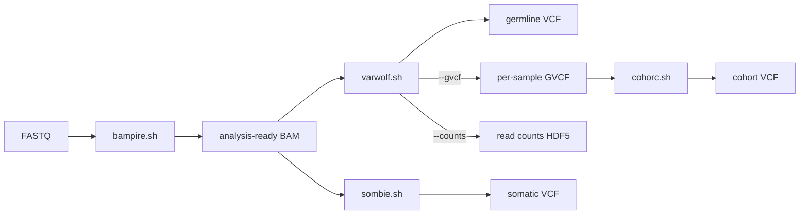

# menagerie

A small bestiary of GATK-based sequencing pipelines for SLURM clusters.

Each script is a single self-contained stage of a short-read DNA analysis workflow, written as an `sbatch` job. They chain together — the output of one is an input to the next — but each can be run on its own, and each explains itself if you run it with no arguments.

The names follow one joke: a monster with its first syllable replaced by the file format or data
type it deals with.

| Script | Takes | Produces |
|---|---|---|
| [`bampire.sh`](bampire.sh) | FASTQ | analysis-ready BAM |
| [`varwolf.sh`](varwolf.sh) | BAM | filtered germline VCF, optionally GVCF and read counts |
| [`sombie.sh`](sombie.sh) | tumor BAM (and matched normal) | filtered somatic VCF |
| [`cohorc.sh`](cohorc.sh) | multiple GVCFs | joint-genotyped cohort VCF |

## How they fit together



The two common routes:

```bash
# Single sample, germline
sbatch -c 64 -o logs/SAMPLE_%x_%A.log bampire.sh -I SAMPLE_R1.fastq.gz,SAMPLE_R2.fastq.gz \
    -O /path/to/out -S SAMPLE -R /path/to/hg38.fasta
sbatch -o logs/SAMPLE_%x_%A.log varwolf.sh -I /path/to/out/bams/SAMPLE.bam \
    -O /path/to/out -S SAMPLE -R /path/to/hg38.fasta

# Cohort, joint-genotyped — note --gvcf on the per-sample step
sbatch -o logs/SAMPLE_%x_%A.log varwolf.sh --gvcf -I .../SAMPLE.bam -O /path/to/out -S SAMPLE -R hg38.fasta
sbatch -o logs/COHORT_%x_%A.log cohorc.sh -I gvcf_list.txt -O /path/to/out -C COHORT -R hg38.fasta
```

Every script prints full usage when called with no arguments. That usage text is the authoritative
flag reference; what follows is orientation, not a substitute for it.

## The scripts

### bampire.sh — FASTQ to analysis-ready BAM

`fastp` (adapter/quality trimming, streamed) → `bwa-mem2 mem` → `samtools sort -n` →
`gatk MarkDuplicatesSpark` → `gatk BQSRPipelineSpark`.

Read groups are derived automatically from the FASTQ header (flowcell and library from the first
read), so multi-lane samples merge correctly. Pass `--custom-rg` for non-Illumina data. Multiple
lanes go in as a CSV file, one `R1,R2` pair per line; the lanes are aligned separately and merged at
the MarkDuplicates step.

Useful flags: `--skip-bqsr` (much faster and smaller, not GATK best practice), `--legacy-bwa` (falls
back to original `bwa` when no bwa-mem2 index exists).

Defaults: 64 cpus, 256 GB, 1 day. Minimum 8 threads.

### varwolf.sh — BAM to germline VCF

`gatk HaplotypeCaller` run as 25 concurrent per-chromosome jobs (chr1–22, X, Y, M) → `MergeVcfs` →
`VariantFiltration`.

Hard filters are applied as FILTER tags rather than dropping rows: `QD < 2.0`, `SOR > 3.0`,
`MQ < 40.0`, genotype `DP < 10`, genotype `GQ < 20`, heterozygous allelic balance `< 0.2`, and
ALT depth `< 4`.

Useful flags: `--gvcf` (emit a per-sample GVCF for `cohorc.sh`, plus a single-sample VCF via
`GenotypeGVCFs`), `--counts` (a binned read-count HDF5 for CNV calling), `-L` (target BED for
exome/panel), `--singlethread` (drop per-chromosome parallelism when running many samples at once).

Defaults: 32 cpus, 128 GB, 3 days. Both `-L` and `--singlethread` disable the per-chromosome fan-out,
so submit those with `-c 2` to avoid reserving cores you will not use.

### sombie.sh — tumor BAM to somatic VCF

`gatk Mutect2` per chromosome → `MergeVcfs` + `MergeMutectStats` → `LearnReadOrientationModel` →
`GetPileupSummaries` + `CalculateContamination` → `FilterMutectCalls` → a chain of optional
`bcftools` tagging steps.

Works in matched tumor-normal mode (`-N normal.bam`) or tumor-only. Output is named
`<sample>-tumor-normal.vcf.gz` or `<sample>-tumor-only.vcf.gz` so the two modes never collide. Sample
names are read from the BAM read groups unless given explicitly, and the script reorders VCF sample
columns when Mutect2 puts the normal first.

The post-Mutect2 filters all *tag* the FILTER column rather than deleting rows, so nothing is lost
irreversibly: `--min-depth`, `--min-alt-reads`, `--min-vaf`, and `--blacklist-filter` (ENCODE
blacklist). Panel of normals, germline resource, and contamination resource default to the GATK
hg38 bundles and can be overridden with `--custom-pon`, `--custom-germline`, `--custom-common`.

Defaults: 32 cpus, 128 GB, 3 days.

Note: `FilterAlignmentArtifacts` is present but commented out — it misbehaved and was removed
deliberately. Leave it that way unless you have re-tested it.

### cohorc.sh — GVCFs to a joint-genotyped cohort VCF

`gatk GenomicsDBImport` per chromosome → `GenotypeGVCFs` → `MergeVcfs` → ExcessHet
`VariantFiltration` → `MakeSitesOnlyVcf` → `VariantRecalibrator` (SNP and INDEL models) →
`ApplyVQSR` → PASS selection → genotype-level filtering → `bcftools` normalization.

Input is either a sample sheet with one `.g.vcf.gz` path per line, or the same paths comma-separated
on the command line.

Two VCFs are kept:

- `<cohort>.vcf.gz` — all sites, with ExcessHet and VQSR results recorded in FILTER.
- `<cohort>_<filters>.vcf.gz` — PASS sites only, genotype filtered and normalized. **The suffix is
  built from the thresholds that were actually applied**, so the filename can never drift away from
  what the file contains.

VQSR needs a reasonably large training set, so cohorts under 10 samples are rejected. Trio calling
and pedigree-based genotype refinement are out of scope.

Useful flags: `--snp-ts` / `--indel-ts` (truth sensitivity, default 99.5 / 99.0), `--max-gaussians`
(lower it if the INDEL model fails to converge on a small cohort), `--no-excess-het` (the default
threshold assumes unrelated samples — turn it off for cohorts containing relatives), `--min-dp` /
`--min-gq` / `--min-ab` (genotype filtering), `--max-missing`, `--update-gdb` (add samples to
existing GenomicsDB workspaces instead of erroring out).

GenomicsDB workspaces under `<out_dir>/gdbs/<cohort>/` are never deleted, so `--update-gdb` can add
samples later without rebuilding from scratch.

Defaults: 64 cpus, 500 GB, 3 days.

## Conventions

**Output layout.** All four scripts take `-O <out_dir>` and create their own subdirectories inside
it, so a whole project can share one output root:

```
<out_dir>/
├── bams/              # bampire.sh
│   └── metrics/       #   fastp reports, duplication metrics
├── vcfs/              # varwolf.sh, sombie.sh, cohorc.sh
│   └── metrics/       #   bcftools stats, plot-vcfstats, contamination tables
├── counts/            # varwolf.sh --counts
└── gdbs/              # cohorc.sh GenomicsDB workspaces (never auto-deleted)
```

**Intermediates are cleaned up.** Each script removes its own per-chromosome shards and staging files
on success. `cohorc.sh --keep-intermediates` opts out.

**Logging.** Name log files after the sample (or cohort) plus the job name and ID:
`-o .../logs/SAMPLE_%x_%A.log`.

**Threading.** The default `-c` in each `#SBATCH` header matches the script's parallelization
strategy. Do not raise it. Do lower it to `-c 2` whenever you disable per-chromosome fan-out with
`-L` or `--singlethread`, otherwise you reserve cores that sit idle for days.

**Do not run these on the login node** except to see the usage text.

## Requirements

- **SLURM.** These are `sbatch` scripts and read `$SLURM_CPUS_PER_TASK`.
- **A conda environment named `gatk`**, activated by every script, providing: GATK 4, `bwa-mem2`
  (and `bwa`), `samtools`, `bcftools` (with the `+fill-tags` plugin), `fastp`, `tabix`, and
  `plot-vcfstats`.
- **A reference genome** with a `.fai`, a `.dict`, and a bwa-mem2 index alongside it.
- **GATK hg38 resource bundles** for dbSNP, the panel of normals, gnomAD, HapMap, Omni, 1000G, Mills,
  and the ENCODE blacklist.

### Site configuration

Resource paths are currently hardcoded to this cluster and are the first thing to change when moving
the scripts elsewhere:

| Script | Line | Path |
|---|---|---|
| `bampire.sh` | [81](bampire.sh#L81) | dbSNP, for BQSR known sites |
| `sombie.sh` | [56–60](sombie.sh#L56-L60) | panel of normals, gnomAD germline + common biallelic, ENCODE blacklist |
| `cohorc.sh` | [183–186](cohorc.sh#L183-L186) | HapMap, Omni, 1000G high-confidence SNPs, Mills gold-standard indels |

`cohorc.sh --build` selects the VQSR resource set (currently `hg38` only). It deliberately does not
set the reference FASTA, because the various hg38 subversions — with or without alt contigs — all
work against the same resource files.

## Not in this repo

`varwolf.sh --counts` writes a read-count HDF5 intended for `copycat.sh`, a CNV-calling stage that
does not exist yet. The counts are still produced and are usable with GATK's germline CNV tools
directly.

`refs/` and `output/` are gitignored — this repo tracks the scripts only, not data.
